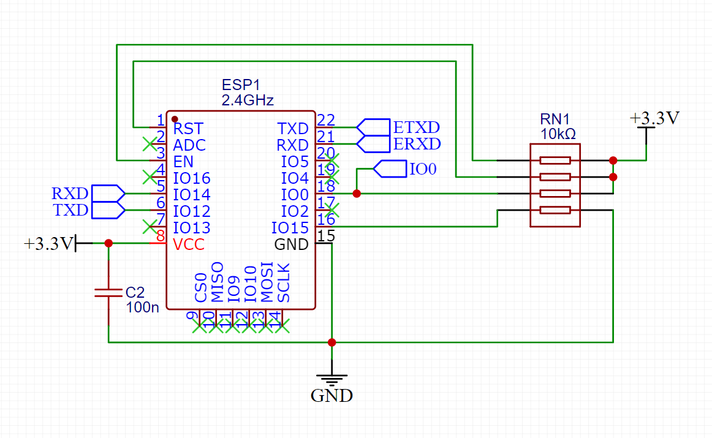
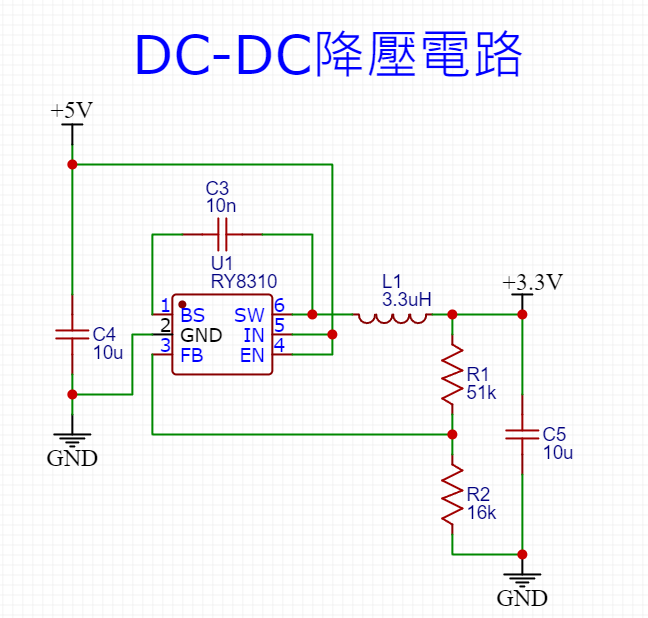
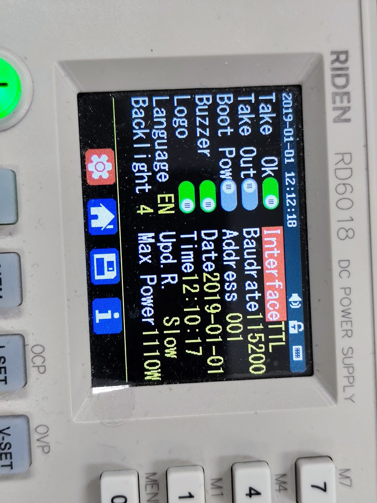
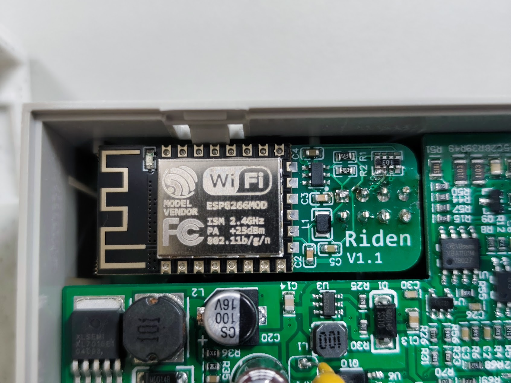

測試設備

型號: RD6018、RD6006

韌體: V1.39

值得注意是RD6018和RD6006的電流小數點後的位數不一樣

使用的MCU是ESP8266，為了回流焊方便，使用ESP-12F的模組，實際上只要同一系列的封裝一致都可通用。

為了使其能量轉換效率較高，使用開關模式電源(Switch Mode Power Supply, SMPS)，使用的轉換器為RY8310，規格為30V 1A 1.4MHz同步降壓穩壓器，實際上只是由5V降壓至3.3V，R1與R2電阻使用51k與16k，Datasheet包含許多種版本，請自行查找。

首先使用此模組，您必須將通訊協定設定為TTL。

當你安裝完畢，應該會如下圖
